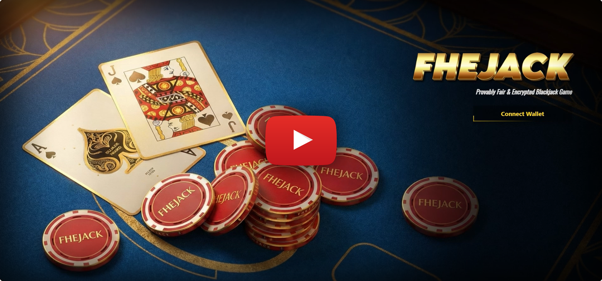
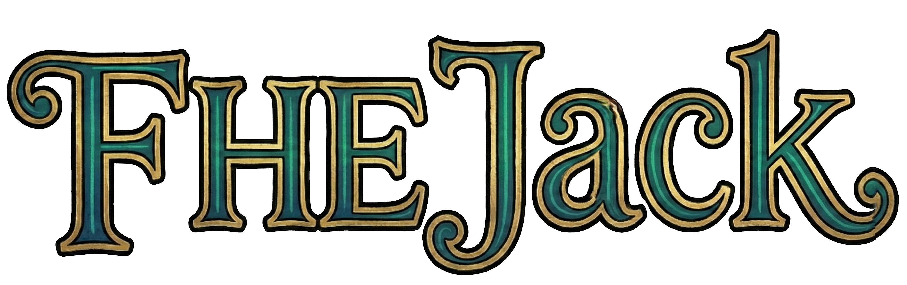

### 🃏 FHEJack: Fully Encrypted & Provably Fair Blackjack

FHEJack is an innovative on-chain card game that merges the excitement of classic Blackjack with the privacy-preserving power of Fully Homomorphic Encryption (FHE). Unlike traditional online casinos, FHEJack ensures that card distribution remains encrypted on the blockchain, only revealing information to the specific actor when necessary. This architecture strictly adheres to the "Don't Trust the House, Trust the Code" philosophy.

</br>

<p align="center">
  <a href="https://youtu.be/7j2tiXlrMWI">
    
  </a>
  </br></br>
  
</p>


### Key Features & Architecture

This project utilizes a Hybrid FHE Architecture to combine the security of the blockchain with the speed of web2 gaming.

FHE-Powered RNG: The game initiates on the blockchain. The contract generates a unique "Game ID" and a Random Seed using Homomorphic Encryption. This seed is mathematically encrypted such that no one(not even the server) can predict it during generation.

Lightning Fast Gameplay (Off-Chain): While the deal is settled on-chain, gameplay actions (HIT/STAND) occur off-chain via a secure Node.js Oracle.

<ul>
  <li>Zero Latency: Moves take 100ms.</li>
  <li>Gasless Actions: You don't pay gas fees for every card you draw.</li>
  <li>Signed Responses: The server returns the card data accompanied by a cryptographic signature.</li>
</ul>

Oracle & Signature Settlement: The encrypted seed is shared securely (via Re-encryption/ACL) only with the authorized "Referee Server" (Oracle). The server uses this to determine the card sequence deterministically.

Secure On-Chain Payout: When the game ends, the server generates a "Winning Ticket" (a data packet containing the result and a cryptographic signature). The user submits this ticket to the blockchain to claim their winnings instantly. The contract verifies the signature before releasing funds.

</br>


### Technical Workflow and Data Flow

Initialization (Handshake)
--------------------------
The user connects to the site via MetaMask. Their balance is fetched from the blockchain (if it’s their first login, it appears as 0). There is a “Faucet” button in the top-right corner to request funds.
On the frontend (using fhevmjs), a one-time signature is requested from the user to generate a Re-encryption Key. This key ensures that the user can only view their own encrypted cards.

Encrypted Distribution (On-Chain)
---------------------------------
When the user sets a bet and clicks the “Deal” button, the smart contract is triggered. The contract generates the cards as euint8 (encrypted data type). At this stage, all cards are fully encrypted on the blockchain; miners or network observers cannot see them.

Blind Computation (FHE Operations)
----------------------------------
When the user draws a card (Hit), the addition operation is performed on encrypted values (Encrypted Card + Encrypted Total). The resulting new total remains encrypted.

Oracle Verification (Backend)
-----------------------------
When the dealer’s cards are revealed or the game ends, a Node.js Oracle running on Render is invoked. When necessary, it validates the game flow and updates the on-chain state.

Result (Reveal)
---------------
At the end of the game, the smart contract performs an encrypted comparison (UserTotal > DealerTotal). If the user wins, the balance transfer is executed.


### Tech Stack

This project represents a fusion of modern web and next-gen privacy blockchain technologies:

<i>Frontend:</i> React and UI/UX libraries.

<i>Blockchain:</i> Solidity, Hardhat, FHEVM (Fully Homomorphic Encryption Virtual Machine).

<i>Backend/Oracle:</i> Node.js, Ethers.js v6 (for signing and verification).

<i>Interaction:</i> Ethers.js v6.

</br>

### How It Works (The Flow)

<ul>
  <li>The Deal (On-Chain): The user clicks DEAL and deposits the bet (e.g., 100 Tokens) to the smart contract. The contract uses FHE to generate an encrypted seed.</li>
  <li>The Play (Off-Chain): The user clicks HIT. This request is sent to the Node.js Oracle (not the blockchain). The Oracle uses the seed to draw a card and returns it with a digital signature. The frontend updates instantly.</li>
  <li>The Result (On-Chain Settlement): Upon STAND or BUST, the server provides a final signed payload: (Winner: User, Amount: 200, Signature: 0xAbc...).</li>
  <li>The Claim: The user sends this signature to the Smart Contract. The contract verifies: "Does this signature belong to our authorized Oracle?" If yes, the funds are released to the user's wallet.</li>
</ul>

</br>

### Installation & Setup

Follow these steps to run the project locally.

Prerequisites

•Node.js (v16 or higher)
•Metamask (configured for Inco Network or local FHEVM)
•Git

1. Clone the Repository

```bash
git clone https://github.com/Sedshwarz/FHEJack
cd FHEJack
```

2. Install Dependencies

```bash
npm install
# or
yarn install
```

3. Environment Configuration (.env)

```bash
YOUR_RPC_URL=https://testnet.inco.org # Or your local FHEVM RPC
ANY_PK=0x...                          # Deployed Blackjack Contract Address
YOUR_ORACLE_URL=http://localhost:3000 # Your Node.js Oracle URL
```

4. Run the Application

```bash
cd backend
node server.js
```

```bash
cd frontend
npm start
```

Open http://localhost:3000 in your browser to start playing.
